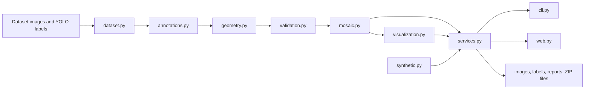

# Architecture

The toolkit separates computer-vision geometry from I/O and user interfaces. This keeps the transformation rules testable and prevents CLI or web code from becoming a second source of bounding-box math.

## Module Responsibilities

| Module | Responsibility |
| --- | --- |
| `models.py` | Typed dataclasses and configuration objects |
| `annotations.py` | YOLO row parsing and serialization |
| `geometry.py` | Coordinate conversion, clipping, letterbox transforms, scaling, and offsets |
| `validation.py` | Repair, visibility filtering, minimum-size filtering, and statistics |
| `image_ops.py` | OpenCV image loading, writing, and letterbox resizing |
| `dataset.py` | Image discovery, label matching, missing-label policies |
| `mosaic.py` | Deterministic equal-cell 2x2 and 3x3 mosaic composition |
| `visualization.py` | Deterministic class colors and BGR/RGB-aware box rendering |
| `synthetic.py` | Reproducible synthetic dataset generation |
| `reporting.py` | JSON report and CSV manifest writing |
| `services.py` | Shared workflows for CLI, web, and benchmark paths |
| `cli.py` | Typer command definitions |
| `web.py` | Gradio interface that calls the shared service layer |

## Key Invariants

- Internal boxes are pixel XYXY while transformations are applied.
- YOLO normalization happens only when image dimensions are known.
- Internal geometry keeps floating-point precision.
- Letterbox image placement and bounding-box transforms share the same `LetterboxTransform`.
- Repaired and clipped boxes are filtered before serialization.
- Source annotation validation and post-transform mosaic validation share the same `ValidationConfig`.
- CLI and web code never implement bounding-box mathematics directly.

## Error Handling

The toolkit rejects non-finite values, negative class IDs, zero-area boxes, and boxes that fall below size or visibility thresholds. Missing labels can be treated as empty, skipped, or errors. Output files are not overwritten unless `--overwrite` is supplied. Web ZIP exports are kept in a temporary export directory and old export folders are removed after a retention window so downloads can finish without accumulating indefinitely.
