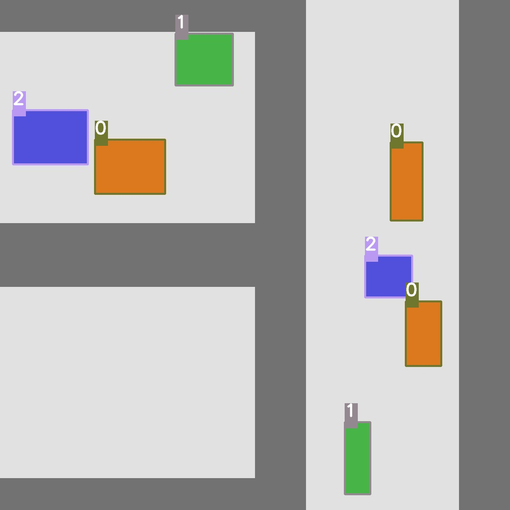
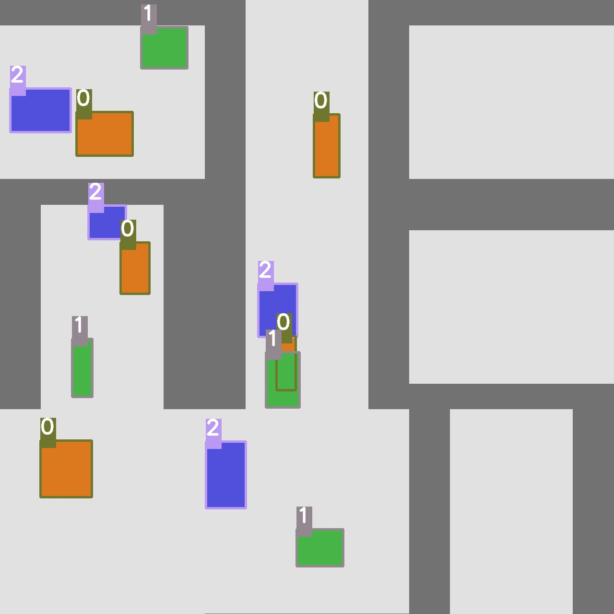
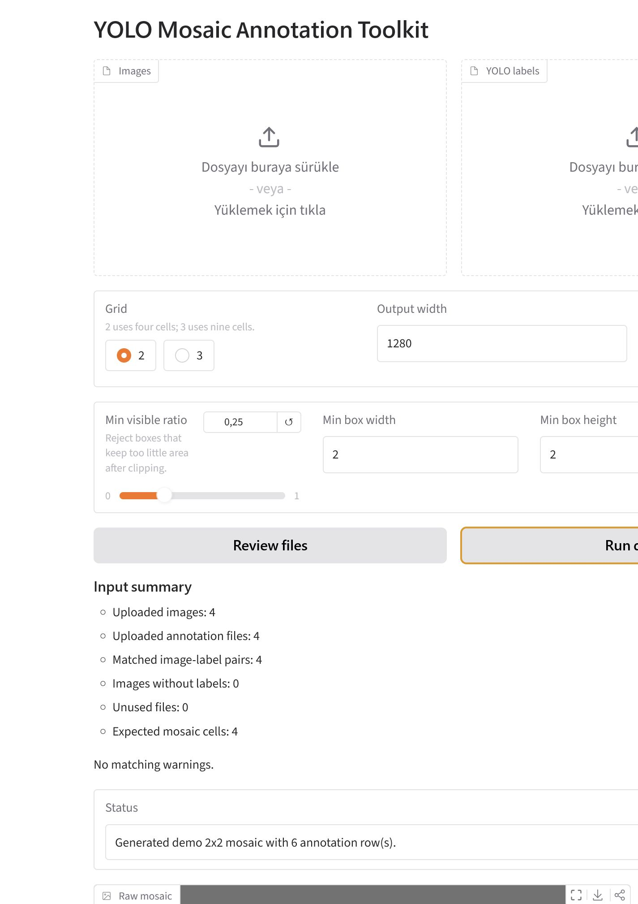

# Reproducible Examples

These examples use only commands and assets produced by this repository. Add `--overwrite` when regenerating files that already exist in a local checkout.

## 1. Generate A Synthetic Dataset

```bash
yolo-mosaic synthetic \
  --output-dir examples/synthetic_dataset \
  --num-images 30 \
  --seed 42 \
  --overwrite
```

Generated files:

- `examples/synthetic_dataset/images/`
- `examples/synthetic_dataset/labels/`
- `examples/synthetic_dataset/classes.txt`
- `examples/synthetic_dataset/summary.json`

## 2. Generate 2x2 Mosaics

```bash
yolo-mosaic generate \
  --images-dir examples/synthetic_dataset/images \
  --labels-dir examples/synthetic_dataset/labels \
  --output-images-dir examples/outputs/2x2/images \
  --output-labels-dir examples/outputs/2x2/labels \
  --grid 2 \
  --count 2 \
  --seed 42
```

Visualize the 2x2 labels:

```bash
yolo-mosaic visualize \
  --images-dir examples/outputs/2x2/images \
  --labels-dir examples/outputs/2x2/labels \
  --output-dir examples/outputs/2x2/visualized
```



## 3. Generate 3x3 Mosaics

```bash
yolo-mosaic generate \
  --images-dir examples/synthetic_dataset/images \
  --labels-dir examples/synthetic_dataset/labels \
  --output-images-dir examples/outputs/3x3/images \
  --output-labels-dir examples/outputs/3x3/labels \
  --grid 3 \
  --count 1 \
  --seed 42
```

Visualize the 3x3 labels:

```bash
yolo-mosaic visualize \
  --images-dir examples/outputs/3x3/images \
  --labels-dir examples/outputs/3x3/labels \
  --output-dir examples/outputs/3x3/visualized
```



## 4. Validate Annotations

```bash
yolo-mosaic validate \
  --images-dir examples/synthetic_dataset/images \
  --labels-dir examples/synthetic_dataset/labels \
  --output-labels-dir examples/outputs/repaired-labels \
  --min-visible-ratio 0.25 \
  --min-box-width 2 \
  --min-box-height 2
```

The command parses YOLO rows, repairs reversed coordinates, clips boxes to image boundaries, and writes repaired labels when an output directory is supplied.

## 5. Launch The Web Interface

```bash
yolo-mosaic web --host 127.0.0.1 --port 7860
```

Open [http://127.0.0.1:7860](http://127.0.0.1:7860).



## 6. Run The Benchmark

```bash
yolo-mosaic benchmark --output-dir examples/benchmark --overwrite
```

The benchmark writes `examples/benchmark/benchmark_report.json` with measured local timing data. Do not copy timing numbers into portfolio text unless you rerun the benchmark on the machine you want to report.
